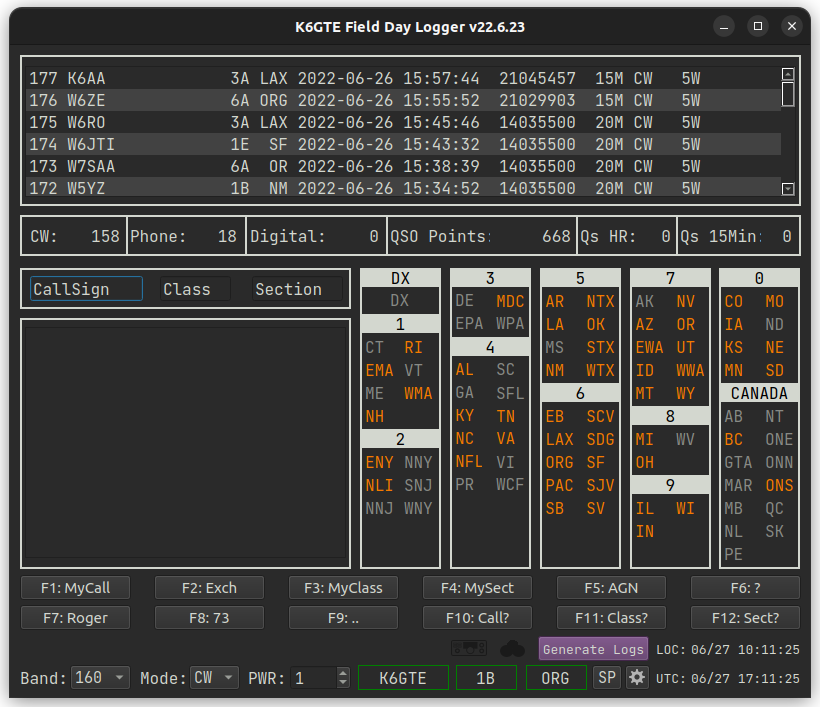

# K6GTE Field Day logger (GUI)

    

[ARRL Field Day](http://field-day.arrl.org/) is a once a year 24hr emergency 
preparidness event for radio amateurs (Hams). During the event, we try and 
make as many radio contacts with other Hams in a 24 hour period. You can find 
out more about amateur radio by visiting the [ARRL](https://www.arrl.org/).

The logger is written in Python 3, and uses the PyQT5 lib. Qt5 is cross 
platform so it might work on everything. I have tested it on Linux, Rasperry 
Pi OS and Windows 10. This code is based off of a logger I had done earlier 
using Python and the curses library wich can be found 
[here](https://github.com/mbridak/FieldDayLogger-Curses) and one written for 
Winter Field Day [here](https://github.com/mbridak/wfd_py_logger).

The log is stored in an sqlite3 database file 'FieldDay.db'. If you need to 
wipe everything and start clean, just delete this file and re-run the logger

The logger will generate a cabrillo file 'YOURCALL.log' and a 'Statistics.txt' 
file with a band/mode/power breakdown which you can use when you submit your 
logs to the ARRL online [here](http://field-day.arrl.org/fdentry.php). An ADIF 
file will also be generated so you can merge contacts into your normal Log.

Read the manual [here](Manual.md)

